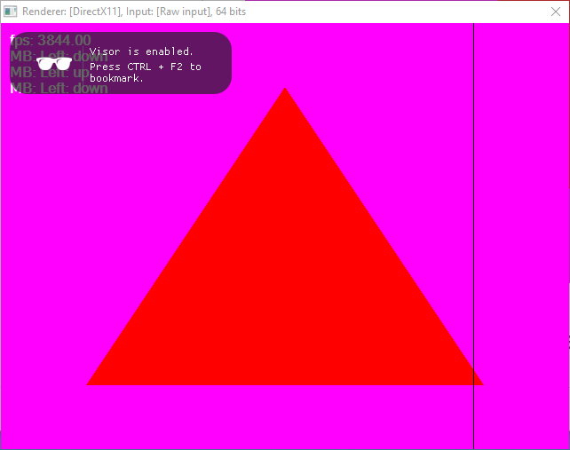

# Visor
A game capture system, along with a social media platform dedicated to sharing videogame clips.

## Installing
You can download the latest version of Visor from https://visor.gg/notyetourdomain.

## Building
LOL

## About the project
### Injection
Visor includes a custom DLL injector which will inject our library along with its dependencies into any valid graphics application.

In the future we would like to automate the process by periodically scanning the list of running processes and attempt to match the processes with a known list of valid game processes.

### Overlay
Using our library, we're able to render an overlay over a graphics application to show the user notifications.

### Supported graphics libraries
Visor will support the following graphics libraries:
- DirectX9
- DirectX10 (not yet implemented)
- DirectX11
- DirectX12 (not yet implemented)
- OpenGL 
- Vulkan (upcoming)

### Credits
The projects that made Visor possible:
- MinHook
- ImGui

The people that made Visor possible:
- Francesco Compagnoni (frannyfx)
- Nerius Ilmonas (Neriuzz)