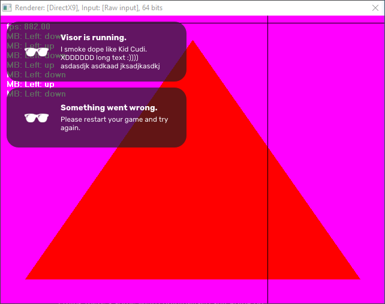

# Visor
A game capture system, along with a social media platform dedicated to sharing videogame clips.

## Installing
You can download the latest version of Visor from https://visor.gg/notyetourdomain.

## Building
### VCPKG 
Install the following packages:
- ffmpeg[avresample,bzip2,core,ffmpeg,ffplay,ffprobe,ffserver,gpl,lzma,nonfree,opencl,openssl,version3,x264] (x86-windows, x64-windows)
- x264 (x86-windows, x64-windows)
- websocketpp (x86-windows, x64-windows)
- protobuf (x86-windows, x64-windows)
- boost-random (x86-windows, x64-windows)

## About the project
### Injection
Visor includes a custom DLL injector which will inject our library along with its dependencies into any valid graphics application.

In the future we would like to automate the process by periodically scanning the list of running processes and attempt to match the processes with a known list of valid game processes.

### Overlay
Using our library, we're able to render an overlay over a graphics application to show the user notifications.

### Progress
- 29/04/2020:
    - Add sending frames over WebSocket to encoder server for DirectX9. (way too slow, will need to reimplement video streaming over named pipes)
- 28/04/2020:
    - Add basic font loading.
    - Improve notification appearance.
    - Add calculated vertical centering on notifications.
- 27/04/2020:
    - Make hook installation wait for previous hooks to be installed.
    - Fix DX11 and DX12 compatibility issues.
    - Start work on encoder.
- 26/04/2020:
    - Add notification stacking and animations.
- 25/04/2020:
    - Migrate from PolyHook2 to MinHook.
    - Add OpenGL hooking.
    - Add image rendering on a per-graphics-API basis.
    - Add protocol buffers for communication.
- 24/04/2020:
    - Add DX11 hooking.
- 23/04/2020:
    - Add DLL injection.
    - Add DX9 hooking.

### Supported graphics libraries
Visor will support the following graphics libraries:
- DirectX9
- DirectX10 (not yet implemented)
- DirectX11
- DirectX12 (not yet implemented)
- OpenGL 
- Vulkan (upcoming)

### Credits
The projects that made Visor possible:
- MinHook
- ImGui

The people that made Visor possible:
- Francesco Compagnoni (frannyfx)
- Nerius Ilmonas (Neriuzz)